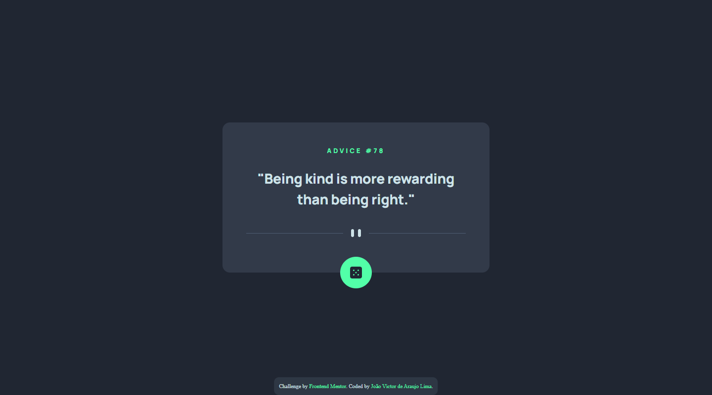
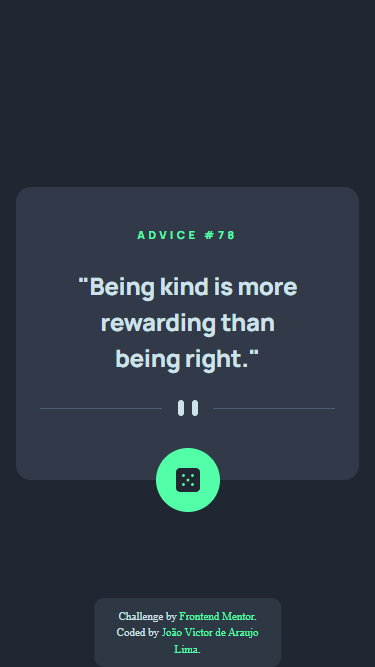

# Frontend Mentor - Advice generator app solution

## Languages

This first section is in English.

[Versão em português logo abaixo.](#portuguese)

## Context

This is a solution to the [Advice generator app challenge on Frontend Mentor](https://www.frontendmentor.io/challenges/advice-generator-app-QdUG-13db). Frontend Mentor challenges help you improve your coding skills by building realistic projects.

> Your challenge is to build out this advice generator app using the [Advice Slip API](https://api.adviceslip.com/) and get it looking as close to the design as possible.

## Table of contents

- [Overview](#overview)
  - [The challenge](#the-challenge)
  - [Screenshot](#screenshot)
  - [Links](#links)
- [My process](#my-process)
  - [Built with](#built-with)
  - [What I learned](#what-i-learned)
- [Author](#author)

## Overview

### The challenge

Users should be able to:

- View the optimal layout for the app depending on their device's screen size
- See hover states for all interactive elements on the page
- Generate a new piece of advice by clicking the dice icon

### Screenshot

#### Desktop

<p align="center">
  
</p>

#### Mobile

<p align="center">
  
</p>

### Links

- Solution URL: [GitHub Repository](https://your-solution-url.com) and [my Frontend Mentor solution page](https://your-live-site-url.com)
- Live Site URL: [Live Page](https://your-live-site-url.com)

## My process

### Built with

- Semantic HTML5 markup
- CSS custom properties
- Flexbox
- clamp()
- JavaScript
- API

### What I learned

In this project I was able to use flexbox, and CSS variable, as well as using a ready-made Figma design to create this component. I also used `rem` for measurements, `clamp()` to help with responsiveness, and BEM methodology for naming classes.

In this project I also used JavaScript and an API to generate the random advice.

```js
async function newAdvice() {
  const url = "https://api.adviceslip.com/advice";
  const response = await fetch(url);
  return await response.json();
}
```

## Author

- Website - [João Víctor de Araujo Lima's Portfolio](https://xuaun.github.io/)
- Frontend Mentor - [@xuaun](https://www.frontendmentor.io/profile/xuaun)

---

<br>

# <p id="portuguese">Frontend Mentor - Solução do projeto de Aplicativo gerador de conselhos</p>

## Contexto

Esta é uma solução para o [desafio de um aplicativo gerador de conselhos no Frontend Mentor](https://www.frontendmentor.io/challenges/huddle-landing-page-with-a-single-introductory-section-B_2Wvxgi0). Os desafios do Frontend Mentor ajudam você a melhorar suas habilidades de codificação construindo projetos realistas.

> Seu desafio é criar este aplicativo gerador de conselhos usando a [Advice Slip API](https://api.adviceslip.com/) e fazer com que ele tenha a aparência mais próxima possível do design.

## Lista de conteúdos

- [Visão Geral](#visão-geral)
  - [Desafio](#desafio)
  - [Prints](#prints)
  - [Links](#links-pt)
- [Meu processo](#meu-processo)
  - [Tecnologias utilizadas](#tecnologias-utilizadas)
  - [O que eu aprendi](#o-que-eu-aprendi)
- [Autor](#autor)

## Visão Geral

### Desafio

Os usuários devem ser capazes de:

- Visualize o layout ideal para o aplicativo dependendo do tamanho da tela do dispositivo
- Veja os estados de foco para todos os elementos interativos na página
- Gere um novo conselho clicando no ícone de dado

### Prints

#### Computador

<p align="center">
  
</p>

#### Celular

<p align="center">
  
</p>

### <p id="links-pt">Links</p>

- Link da solução: [Repositório no GitHub](https://github.com/xuaun/fylo-data-storage-component) e a [página da minha solução no Frontend Mentor](https://your-live-site-url.com)
- Site com a solução: [Página do projeto no ar](https://your-live-site-url.com)

## Meu processo

### Tecnologias utilizadas

- HTML5
- CSS
- Flexbox
- clamp()
- JavaScript
- API

### O que eu aprendi

Neste projeto eu pude utilizar conceitos de flexbox e de variáveis no CSS, além de usar um design pronto do Figma para a elaboração deste componente. Eu também usei `rem` para medidas, `clamp()` para ajudar na responsividade e metodologia BEM para nomear classes.

Neste projeto eu também usei JavaScript e uma API para gerar os conselhos aleatórios.

```js
async function newAdvice() {
  const url = "https://api.adviceslip.com/advice";
  const response = await fetch(url);
  return await response.json();
}
```

## Autor

- Website - [Portfólio - João Víctor de Araujo Lima](https://xuaun.github.io/)
- Frontend Mentor - [@xuaun](https://www.frontendmentor.io/profile/xuaun)
